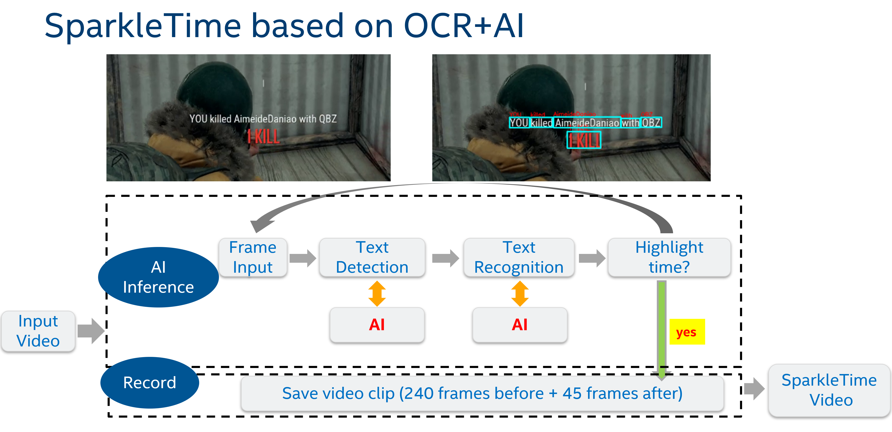

# SparkleTime

## Introudction
* SparkleTime can record highlight moment with a streaming video. This usage is based on [OpennVINO](https://software.intel.com/en-us/openvino-toolkit) tech support. Details are WIP.



* Current version supports for highlighting three games ( PUBG, LOL and World of Tank)
 
* Before run the app, please go to this [link](https://drive.google.com/open?id=1LWjAbX-83Yz_i9x4uMeVzRbcF5uqP6fk) and find video sources. If you cannot access the folder, please feel free to email yaru.du@intel.com

 | video name | path |  
 | -- | -- |
 | test_PUBG.mp4 | .\PUBG\test_PUBG.mp4 |
 | test_lol.mp4 | .\LOL\test_lol.mp4 |
 | test_WoT_1.mp4 | .\World_of_Tank\test_WoT_1.mp4 |

* You can also check the sparkleTime video we colletected

| Game name | path |  
 | -- | -- |
 | PUBG.mp4 | .\PUBG\game_highlights_demo.mp4 |
 | LOL.mp4 | .\LOL\sparkletime_lol.mp4|
 | World of Tank | .\World_of_Tank\sparkletime_wot.mp4 |

 
## Enviroment
* python3.6 **!! Use anaconda to manage python environment is strongly recommended**
* openvino 2020.01 version
  please refer to [OpenVINO@intel windows installation](https://docs.openvinotoolkit.org/latest/_docs_install_guides_installing_openvino_windows.html)
  **!! Need to run setupvars.bat after installation**
* pip install opencv-python

### if you manage enviroment with Anaconda, here is some installation reference.
 
 
 
 
## Run app


* To run World of Tank demo, please use the following command.
```
python game_highlight.py -i testinput/test_PUBG.mp4 -o output -g PUBG
```

* To run World of Tank demo, please use the following command.
```
python game_highlight.py -i testinput/test_lol.mp4 -o output -g LOL
```


* To run World of Tank demo, please use the following command.
```
python game_highlight.py -i testinput/test_WoT_1.mp4 -o output -g WoT
```

## Info @ OpenVINO model

| Model type | Model framework |  Model size | OpenVINO supported
 | -- | -- | -- | -- |
 | Text detection | Pixel_link + MobileNet v2 | 25.7MB | FP32/FP16/INT8 @CPU, FP32/FP16@GPU|
 | Text recognition | LSTM+CTC Loss | 45.3MB |FP32/FP16@CPU, FP32/FP16@GPU |
 
## Performance @ OpenVINO model


## Little trick
* test on one instance 

| \ms |AMD3700U CPU|ICELAKE CPU|
 | -- | -- | -- |
text detection tf|	3161.35	|1541.52
|text recognition tf |	5286.16	|3002.85|
|muscidance tf	|594.9	|238.61|
|musicdance OV FP32|	216.03|	68.54|
|musicdance OV INT8-FP32|	144.8|	58.3|


The performance of FP32 model on intel cpu is better than on AMD cpu benefits from the hardware, not from OpenVINO. Becuase if tensorflow model is tested on both HW, it also has the same gap.


